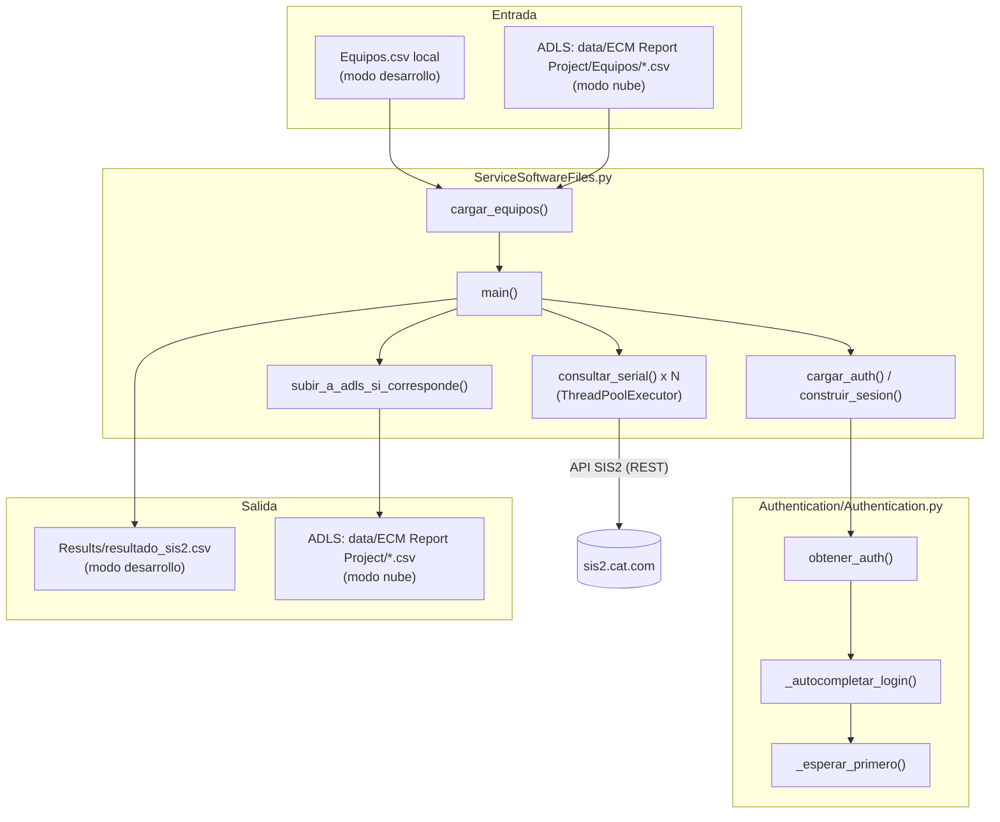
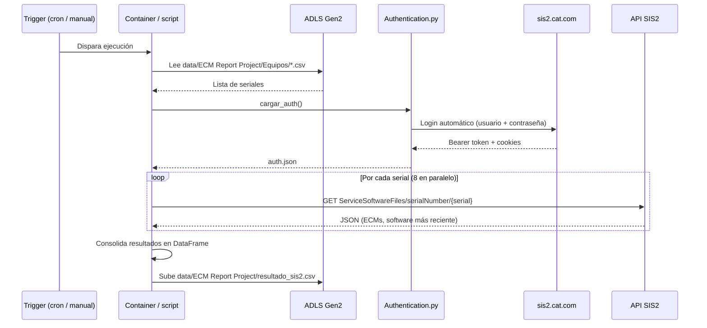

# 01 — Análisis técnico del proyecto

**Proyecto:** proyecto_ecm
**Propósito de este documento:** explicar qué hace el sistema, con qué
tecnologías está construido, y cómo funciona cada módulo del código, con
nivel de detalle suficiente para que cualquier persona (incluido tu "yo" de
dentro de 6 meses) pueda entenderlo sin tener que releer el código línea por
línea.

---

## 1. Resumen ejecutivo

El proyecto extrae, para una lista de equipos mineros (identificados por
número de serie), la versión de software ECM (Engine Control Module) más
reciente publicada por Caterpillar en su portal SIS2, y consolida el
resultado en un archivo CSV para reporte.

**Por qué existe:** SIS2 no ofrece una API pública con autenticación de
aplicación (no hay client_id/client_secret tipo OAuth de servicio). El único
acceso es vía sesión de usuario humano (login SSO de Cat). Este proyecto
automatiza ese login para poder luego consultar el endpoint REST interno de
forma programática y en lote, en vez de hacerlo a mano equipo por equipo
desde el navegador.

**Quién lo usa:** procesos de mantenimiento predictivo / analítica de flota
(equipos 793/797/798 y otros) donde se necesita saber si el software
instalado en el ECM de cada equipo está actualizado respecto a lo último
publicado por Cat.

## 2. Alcance funcional

**Lo que el sistema SÍ hace:**
- Inicia sesión en SIS2 automáticamente (usuario/contraseña, sin
  intervención manual, sin MFA).
- Consulta en paralelo, para cada número de serie de una lista, el archivo
  de software más reciente disponible.
- Reintenta automáticamente si la sesión expira a mitad de una corrida.
- Exporta el resultado a CSV, en local o directamente a un Azure Data Lake
  (ADLS Gen2).
- Puede correr manualmente (tu máquina) o de forma programada y desatendida
  en la nube (Azure Container Apps Jobs).

**Lo que el sistema NO hace (fuera de alcance actual):**
- No compara automáticamente la versión instalada en el equipo real contra
  la última disponible (eso requeriría otra fuente de datos: qué versión
  tiene cada equipo hoy). Solo reporta "cuál es la última versión
  publicada por Cat" para cada serial.
- No maneja MFA/2FA (la cuenta usada actualmente no lo requiere; si Cat lo
  activara en el futuro, la automatización del login dejaría de funcionar
  sin intervención humana — ver sección 7, Limitaciones).
- No re-genera por sí mismo la lista de equipos a consultar: esa lista la
  produce un proceso externo (una query) que la deja en ADLS; este proyecto
  solo la lee.

## 3. Stack tecnológico

| Componente | Tecnología | Por qué |
|---|---|---|
| Lenguaje | Python 3.10+ | Ecosistema maduro para scraping/automatización (Playwright) y datos (pandas) |
| Automatización de navegador | Playwright (Chromium) | Necesario porque el login de SIS2 es una SPA de Azure AD B2C, no un formulario HTML simple que se pueda "postear" directo |
| Cliente HTTP para la API | `requests` | Una vez capturado el token, las consultas al endpoint de archivos de software son REST simple |
| Manejo de datos | `pandas` | Lectura/escritura de CSV, deduplicación |
| Paralelismo | `concurrent.futures.ThreadPoolExecutor` | Las consultas son I/O-bound (esperan red), los threads son suficientes sin la complejidad de `asyncio` |
| Configuración de secretos (local) | `python-dotenv` (`.env`) | Evita hardcodear usuario/contraseña en el código |
| Contenedores | Docker, imagen base `mcr.microsoft.com/playwright/python` | Empaqueta Python + Chromium + todas sus dependencias del sistema en una sola unidad desplegable |
| Cómputo en la nube | Azure Container Apps Jobs | Ejecuta el contenedor con un trigger cron, sin servidor corriendo entre ejecuciones |
| Almacenamiento en la nube | Azure Data Lake Storage Gen2 (ADLS) | Origen de la lista de equipos y destino del reporte, integrado con el resto del stack analítico (Synapse/Power BI) |
| Registro de imágenes | Azure Container Registry (ACR) | Repositorio privado de la imagen Docker del proyecto |
| SDK de Azure usado en código | `azure-storage-file-datalake` | Lectura/escritura directa contra ADLS desde Python |

## 4. Arquitectura de módulos

## 5. Explicación archivo por archivo

### `Authentication/Authentication.py`

Responsable de obtener un token de sesión válido para SIS2, sin
intervención manual.

- **`obtener_auth(headless: bool = True)`** — función principal del
  módulo. Abre un navegador Chromium vía Playwright, navega a
  `https://sis2.cat.com`, engancha un listener sobre todas las
  requests salientes (`page.on("request", ...)`) para capturar el header
  `Authorization: Bearer ...` en cuanto aparezca, y espera a que tanto ese
  bearer como las cookies de sesión (`Sis2_Login`, `Sis2_Refresh`) estén
  presentes. Guarda todo en `Authentication/auth.json`.
  - `headless=True`: sin ventana visible (uso normal, y obligatorio en la
    nube).
  - `headless=False`: con ventana visible — solo para depurar visualmente
    cuando algo falla (ver Manual de Usuario, sección de troubleshooting).
  - Si pasan 60 segundos sin completar el login, lanza `TimeoutError` y
    guarda una captura de pantalla en `Authentication/login_debug.png`
    para diagnóstico.

- **`_autocompletar_login(page)`** — encapsula la lógica específica del
  formulario de Azure AD B2C que usa Cat, que es un flujo de **dos
  pantallas**:
  1. Pantalla de usuario → botón "Continue".
  2. Pantalla de contraseña → botón de envío ("Sign in"/"Continue").

  Llena el usuario, hace clic en continuar, espera la segunda pantalla,
  llena la contraseña, y envía.

- **`_esperar_primero(page, selectors, timeout=15000)`** — función de
  soporte que prueba una lista de selectores CSS candidatos y devuelve el
  primero que efectivamente aparezca visible en la página. Existe porque
  las páginas de Azure B2C personalizadas por cada empresa no siempre usan
  los mismos `id`/`name` de campo, así que en vez de depender de un único
  selector frágil, se prueban varias alternativas conocidas.

### `ServiceSoftwareFiles.py`

Responsable de la lógica de negocio: qué equipos consultar, cómo
consultarlos en paralelo, y dónde dejar el resultado.

- **`cargar_equipos()`** — decide de dónde sacar la lista de seriales:
  - Si detecta `ADLS_STORAGE_ACCOUNT` + `ADLS_FILESYSTEM` +
    `ADLS_INPUT_DIRECTORY` configuradas (entorno cloud), busca todos los
    `.csv` dentro de esa carpeta en ADLS, los descarga, los concatena y
    quita duplicados por `SerialNumber`.
  - Si no (entorno local sin esas variables), usa el `Equipos.csv` del
    repo.

- **`cargar_auth(forzar_relogin=False)`** — si existe `auth.json` y no se
  fuerza relogin, lo reutiliza (evita loguearse de nuevo en cada corrida
  si la sesión sigue siendo válida). Si no existe o se fuerza, llama a
  `obtener_auth(headless=True)`.

- **`construir_sesion(auth_data)`** — arma un `requests.Session` con el
  bearer token y las cookies necesarias en los headers, lista para
  consultar la API REST directamente (sin volver a pasar por el navegador).

- **`_obtener_sesion_vigente()`** / **`_forzar_relogin()`** — manejan la
  sesión HTTP compartida entre los threads paralelos. Usan un
  `threading.Lock` para garantizar que, si el token expira a mitad de una
  corrida con 8 threads activos, **solo uno** dispare el relogin (los demás
  esperan a que termine y reutilizan la sesión nueva), en vez de que los 8
  intenten reautenticar al mismo tiempo.

- **`consultar_serial(serial)`** — la unidad de trabajo que corre en cada
  thread. Llama al endpoint
  `ServiceSoftwareFilesRemoteServices/serialNumber/{serial}`, interpreta la
  respuesta JSON (`ecms[].installedFiles`), y devuelve una lista de filas
  (un equipo puede tener más de un ECM). Si recibe 401/403, dispara
  `_forzar_relogin()` y reintenta una vez. Cualquier otra excepción queda
  registrada como fila de error en el resultado (no interrumpe el resto de
  la corrida).

- **`subir_a_adls_si_corresponde(local_path)`** — si hay configuración de
  ADLS, sube el CSV generado a `ADLS_OUTPUT_DIRECTORY`. Si no, no hace
  nada (el archivo se queda solo en `Results/` local).

- **`main()`** — orquesta todo: carga equipos → lanza el
  `ThreadPoolExecutor` con `MAX_WORKERS` threads → junta resultados →
  exporta CSV local → sube a ADLS si corresponde.

### `Equipos.csv`

Lista de entrada de referencia/desarrollo (una columna `SerialNumber`). En
producción (nube), esta lista la reemplaza dinámicamente lo que haya en
`data/ECM Report Project/Equipos/` en ADLS — este archivo local queda como
respaldo para pruebas rápidas sin depender de la nube.

### `Dockerfile` / `.dockerignore` / `requirements.txt` / `requirements-cloud.txt`

Ver documento `02_ARQUITECTURA_SOLUCION.md` para el detalle de cómo se
empaqueta y despliega todo esto.

## 6. Flujo de datos de punta a punta

## 7. Historial de decisiones y problemas resueltos

Documentado en detalle porque cada uno de estos costó tiempo real de
depuración — si algo similar vuelve a pasar, el diagnóstico ya está hecho:

1. **Credencial real expuesta en git.** El repo original tenía
   `Authentication/auth.json` (con un bearer JWT y cookies reales)
   commiteado en un repositorio público. Se agregó a `.gitignore`, pero
   **sigue en el historial de git** — pendiente purgarlo con
   `git filter-repo` (ver Manual de Usuario).

2. **Script duplicado y roto (`ECM.py`).** Importaba un módulo inexistente
   y usaba una variable nunca definida. Se eliminó.

3. **Login manual → automático.** Se automatizó el llenado del formulario
   con credenciales desde variables de entorno, confirmando primero que la
   cuenta no requiere MFA.

4. **Timeout en `page.goto(..., wait_until="networkidle")`.** SIS2 mantiene
   tráfico de fondo que nunca deja la red "quieta", así que ese modo de
   espera nunca se cumplía. Se cambió a `wait_until="domcontentloaded"`
   con `timeout=60000`.

5. **Login en dos pasos no contemplado.** El formulario de Azure B2C no
   pide usuario y password en la misma pantalla: primero usuario + botón
   "Continue", luego password. Se corrigió secuenciando explícitamente
   ambos pasos en `_autocompletar_login`.

6. **`channel="chrome"` no disponible en Docker.** Localmente se usaba el
   Chrome real de Windows (`channel="chrome"`), pero la imagen Docker de
   Playwright solo trae Chromium (sin marca). Se quitó el parámetro
   `channel` para usar el Chromium bundleado en ambos entornos.

7. **Desajuste de versión Playwright ↔ imagen Docker.** `requirements.txt`
   instalaba la última versión de `playwright` vía pip, pero la imagen
   base traía binarios de una versión anterior. Se fijó
   `playwright==1.48.0` en `requirements.txt` para que coincida con la
   imagen base `mcr.microsoft.com/playwright/python:v1.48.0-jammy`.

8. **Rendimiento secuencial.** Las consultas eran una por una con
   `time.sleep(1)` entre cada una. Se paralelizó con `ThreadPoolExecutor`,
   con cuidado de que el relogin ante token expirado sea único (lock) y no
   se dispare una vez por thread.

9. **Restricciones de permisos en Azure (sin rol de asignación de RBAC).**
   El plan original usaba identidad administrada + rol
   "Storage Blob Data Contributor" para escribir en ADLS sin secretos. El
   usuario no tenía permisos para asignar roles (`az role assignment
   create`), así que se cambió a autenticación por **clave de acceso del
   storage account**, guardada como secreto nativo de Container Apps (no
   de Key Vault, evitando también la necesidad de política de acceso en
   Key Vault). Ver `02_ARQUITECTURA_SOLUCION.md`, sección de seguridad,
   para el trade-off de esta decisión y cómo migrar a RBAC si en el futuro
   se obtienen los permisos.

10. **Fuente del listado de equipos.** Originalmente un CSV fijo dentro
    del repo. Se generalizó `cargar_equipos()` para leer dinámicamente
    desde `data/ECM Report Project/Equipos/` en ADLS cuando hay
    configuración de nube, manteniendo el CSV local como fallback de
    desarrollo — así una actualización semanal del listado (generado por
    una query externa) se refleja automáticamente sin tocar el código.

## 8. Limitaciones conocidas y supuestos

- **Sin soporte de MFA.** Si Cat activa un segundo factor para esta cuenta
  en el futuro, la automatización del login deja de funcionar sin aviso
  claro (probablemente fallará en `_esperar_primero` buscando un campo de
  password que nunca aparece, porque antes apareció una pantalla de
  código). Requeriría rediseño (ej. un servicio de recepción de SMS/TOTP).
- **Duración de la sesión no documentada por Cat.** El sistema reautentica
  automáticamente si detecta 401/403, pero no hay visibilidad de cuánto
  dura una sesión típica hasta que efectivamente expira en producción.
- **Autenticación a ADLS por clave de cuenta, no por identidad
  administrada.** Funciona, pero es una clave con acceso total al storage
  account (no limitada a una carpeta o permiso mínimo). Ver nota de
  seguridad en `02_ARQUITECTURA_SOLUCION.md`.
- **Dependencia de la estructura HTML de Cat.** Cualquier cambio futuro en
  la página de login de SIS2 (nuevos campos, textos de botón distintos,
  un paso adicional) puede romper `_autocompletar_login`. Está diseñado
  para fallar de forma diagnosticable (ver Manual de Usuario), no de forma
  silenciosa.
