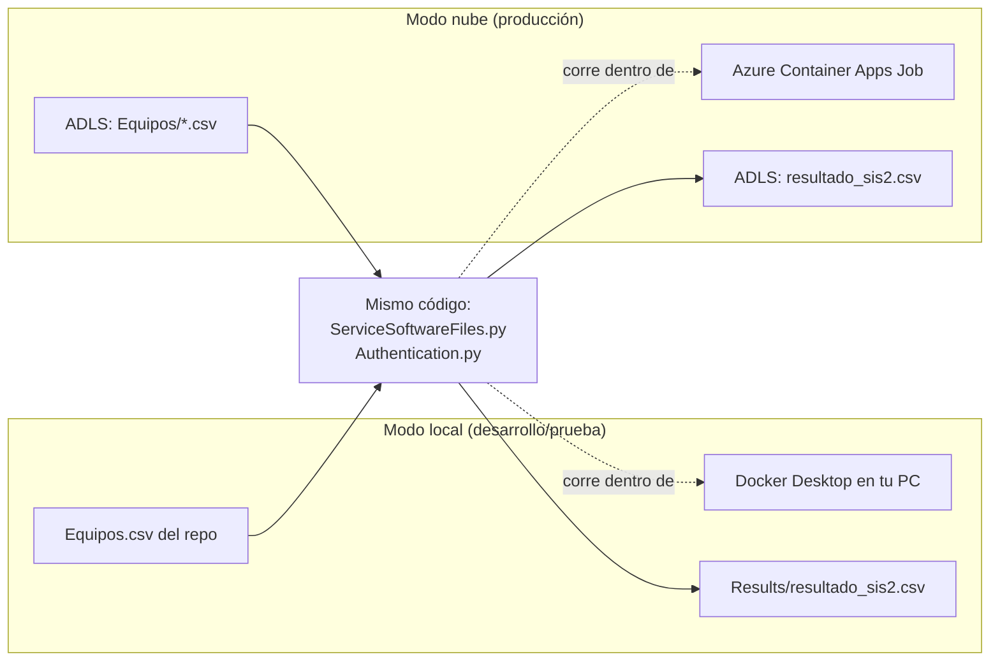
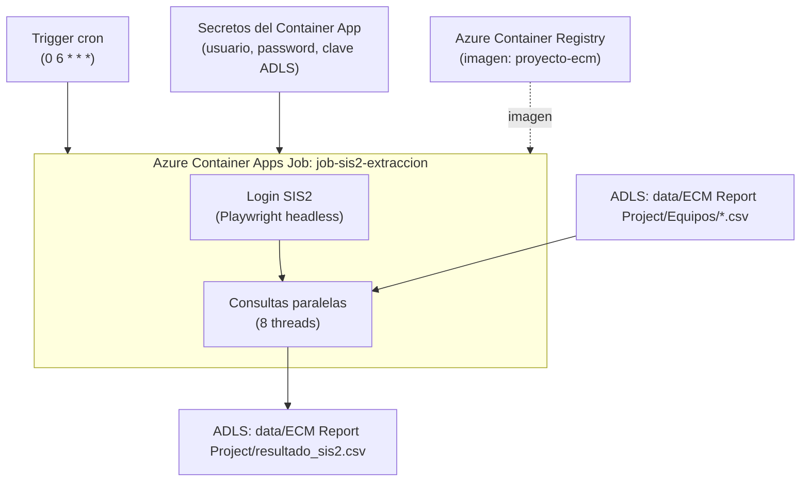
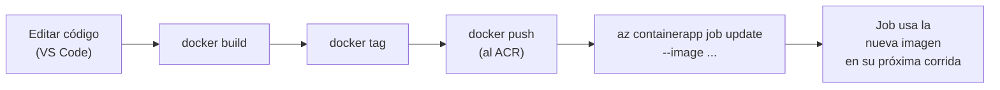

# 02 — Arquitectura de la solución

Este documento cubre cómo está desplegado el sistema: arquitectura local,
arquitectura en la nube, por qué se tomó cada decisión, y la guía de
despliegue paso a paso con los valores reales de este proyecto.

---

## 1. Vista general: local vs. nube

El mismo código corre en dos modos, sin ramas de código separadas — el
comportamiento cambia según qué variables de entorno estén presentes:



La diferencia la determinan estas variables de entorno (ver
`04_VARIABLES_Y_CONFIGURACION.md` para el detalle completo):

| Variable | Presente → modo nube | Ausente → modo local |
|---|---|---|
| `ADLS_STORAGE_ACCOUNT`, `ADLS_FILESYSTEM` | Lee/escribe en ADLS | Usa `Equipos.csv` y `Results/` locales |

## 2. Por qué Azure Container Apps Jobs

El paso crítico (`Authentication.py`) necesita lanzar un Chromium real.
Eso descarta las opciones con sandbox restringido:

| Opción | Problema para este caso | Veredicto |
|---|---|---|
| Azure Functions (Consumption) | Sandbox sin dependencias de sistema para Chromium, timeout de 5 min | ❌ |
| Azure Automation Runbook | Sandbox de Python restringido, sin soporte de browser | ❌ |
| Azure Functions (Premium/Docker) | Técnicamente posible, pero fuerza un caso de uso ajeno a Functions | ⚠️ |
| **Azure Container Apps Jobs** | Contenedor Docker completo, sin restricción de dependencias, trigger cron nativo, se paga solo por el tiempo que corre | ✅ **Elegido** |
| Databricks Job (alternativa) | Viable con init script instalando dependencias de Chromium; más caro por ejecución (paga cluster completo) | Alternativa documentada en sección 8 |

## 3. Componentes de la solución en Azure

Recurso real utilizado en este proyecto (nombres reales de tu entorno):

| Componente | Nombre en este proyecto | Función |
|---|---|---|
| Resource Group | `dv-bigdataikc-rg` | Contenedor lógico de todos los recursos |
| Región | East US | Ubicación física de los recursos |
| Azure Container Registry | `acrbigdataikc` | Repositorio privado de la imagen Docker |
| Container Apps Environment | `env-bigdataikc` | Infraestructura compartida (red, logging) para los Jobs |
| Container Apps Job | `job-sis2-extraccion` | Ejecuta la imagen con trigger cron |
| Storage Account (ADLS Gen2) | `dvbigdataikc2dlkacc` | Origen del listado de equipos y destino del reporte |
| Filesystem/container dentro del storage | `dvbigdataikc2dlkfs` | Namespace jerárquico donde vive la carpeta `data/ECM Report Project/` |
| Key Vault (disponible, no usado en runtime) | `dv-bigdataikc-kv` | Ver nota en sección 5 sobre por qué no se usa en el flujo final |

## 4. Diagrama de despliegue



## 5. Modelo de seguridad y decisión de autenticación a ADLS

**Decisión tomada:** autenticación a ADLS por **clave de acceso del
storage account** (`ADLS_ACCOUNT_KEY`), guardada como **secreto nativo de
Container Apps** — no de Key Vault.

**Por qué, en vez del enfoque "ideal" con identidad administrada:**

El enfoque recomendado en general para este tipo de arquitectura es que el
Container Apps Job tenga una identidad administrada (`--mi-system-assigned`)
y se le asigne el rol RBAC "Storage Blob Data Contributor" sobre el storage
account, sin ningún secreto de por medio. Esto requiere ejecutar
`az role assignment create`, que a su vez requiere un rol como "Owner" o
"User Access Administrator" sobre el resource group o la suscripción.

En este proyecto, el usuario que despliega **no cuenta con permisos para
asignar roles** (confirmado al intentar el flujo original). Pedir ese
permiso puntual a IT es una opción, pero para no bloquear el despliegue se
optó por un camino alternativo que no requiere esa asignación:

1. Se obtiene la clave (`key1`) del storage account con
   `az storage account keys list` (permiso de lectura de claves, distinto
   y más común que "asignar roles").
2. Esa clave se guarda como **secreto propio de Container Apps**
   (`--secrets adls-key=...`), no como referencia a Key Vault — esto evita
   además necesitar una política de acceso (`set-policy`) en Key Vault,
   que también podría requerir permisos elevados según cómo esté
   configurado el vault.
3. El código (`_obtener_file_system_client()` en `ServiceSoftwareFiles.py`)
   usa esa clave para autenticar directamente contra ADLS.

**Trade-off explícito:** una clave de storage account da acceso de
lectura/escritura a **todo** el storage account, no solo a la carpeta
`data/ECM Report Project/` — es un permiso más amplio del que
estrictamente se necesita. Es un compromiso razonable dado el bloqueo de
permisos, pero **si en el futuro alguien con el rol adecuado puede asignar
RBAC**, la recomendación es migrar a identidad administrada:

```bash
# Migración futura (requiere permisos de asignación de roles):
az containerapp job update --name job-sis2-extraccion --resource-group dv-bigdataikc-rg --mi-system-assigned

PRINCIPAL_ID=$(az containerapp job show --name job-sis2-extraccion --resource-group dv-bigdataikc-rg --query identity.principalId -o tsv)

az role assignment create \
  --assignee $PRINCIPAL_ID \
  --role "Storage Blob Data Contributor" \
  --scope "/subscriptions/479cc6a8-48fa-4190-b7ff-5b19c0437851/resourceGroups/dv-bigdataikc-rg/providers/Microsoft.Storage/storageAccounts/dvbigdataikc2dlkacc"
```

El código ya soporta ambos modos sin cambios: si `ADLS_ACCOUNT_KEY` no está
definida, `_obtener_file_system_client()` cae automáticamente a
`DefaultAzureCredential()` (identidad administrada). Migrar es solo quitar
la variable `ADLS_ACCOUNT_KEY` del job y hacer la asignación de rol de
arriba — no requiere tocar ni una línea de código.

**Otras medidas de seguridad ya aplicadas:**
- Credenciales de SIS2 (`SIS2_USERNAME`/`SIS2_PASSWORD`) nunca en el
  código ni en la imagen: viven en `.env` local (gitignored) o como
  secretos de Container Apps en la nube.
- `.dockerignore` excluye explícitamente `.env` y `Authentication/auth.json`
  de la imagen.
- El `auth.json` generado en cada ejecución en la nube vive solo dentro
  del contenedor efímero del job — desaparece al terminar la ejecución.
- **Pendiente:** purgar del historial de git el token real que quedó
  commiteado en una versión antigua del repo (ver Manual de Usuario).

## 6. Guía de despliegue paso a paso (valores reales de este proyecto)

### Paso 0 — Prerrequisitos

- Docker Desktop instalado y corriendo.
- Azure CLI instalado (ver Manual de Usuario si no tienes permisos de
  administrador para instalarlo).
- Login hecho: `az login` + `az account set --subscription 479cc6a8-48fa-4190-b7ff-5b19c0437851`

### Paso 1 — Build y push de la imagen

```powershell
docker build -t proyecto-ecm .

az acr login --name acrbigdataikc

docker tag proyecto-ecm acrbigdataikc.azurecr.io/proyecto-ecm:latest
docker push acrbigdataikc.azurecr.io/proyecto-ecm:latest
```

### Paso 2 — Obtener la clave del storage account

```powershell
az storage account keys list --account-name dvbigdataikc2dlkacc --resource-group dv-bigdataikc-rg
```

Copia el valor de `key1`.

### Paso 3 — Crear el entorno de Container Apps (una sola vez)

```powershell
az containerapp env create `
  --name env-bigdataikc `
  --resource-group dv-bigdataikc-rg `
  --location eastus
```

### Paso 4 — Crear el Container Apps Job

```powershell
az containerapp job create `
  --name job-sis2-extraccion `
  --resource-group dv-bigdataikc-rg `
  --environment env-bigdataikc `
  --trigger-type Schedule `
  --cron-expression "0 6 * * *" `
  --replica-timeout 1800 `
  --image acrbigdataikc.azurecr.io/proyecto-ecm:latest `
  --cpu 1.0 --memory 2Gi `
  --registry-server acrbigdataikc.azurecr.io `
  --secrets `
    "sis2-username=TU_USUARIO_SIS2" `
    "sis2-password=TU_PASSWORD_SIS2" `
    "adls-key=LA_KEY1_QUE_COPIASTE" `
  --env-vars `
    "SIS2_USERNAME=secretref:sis2-username" `
    "SIS2_PASSWORD=secretref:sis2-password" `
    "ADLS_STORAGE_ACCOUNT=dvbigdataikc2dlkacc" `
    "ADLS_FILESYSTEM=dvbigdataikc2dlkfs" `
    "ADLS_INPUT_DIRECTORY=data/ECM Report Project/Equipos" `
    "ADLS_OUTPUT_DIRECTORY=data/ECM Report Project" `
    "ADLS_ACCOUNT_KEY=secretref:adls-key"
```

`--replica-timeout 1800` = 30 minutos máximo por ejecución. Ajusta si con
más equipos la corrida empieza a acercarse a ese límite.

`--registry-server` puede pedir autenticación contra el ACR. Si falla,
habilita el admin user del registro y reintenta:

```powershell
az acr update --name acrbigdataikc --admin-enabled true
```

### Paso 5 — Ejecutar una vez manualmente y validar

```powershell
az containerapp job start --name job-sis2-extraccion --resource-group dv-bigdataikc-rg
az containerapp job logs show --name job-sis2-extraccion --resource-group dv-bigdataikc-rg
```

## 7. Actualizar el despliegue tras un cambio de código

No existe forma de "editar" un contenedor ya desplegado — es una imagen
inmutable. El ciclo completo:



```powershell
docker build -t proyecto-ecm .
docker tag proyecto-ecm acrbigdataikc.azurecr.io/proyecto-ecm:latest
docker push acrbigdataikc.azurecr.io/proyecto-ecm:latest

az containerapp job update `
  --name job-sis2-extraccion `
  --resource-group dv-bigdataikc-rg `
  --image acrbigdataikc.azurecr.io/proyecto-ecm:latest
```

**Nota sobre el tag `:latest`:** a veces Azure no vuelve a bajar la imagen
si el tag no cambió de nombre (queda cacheada). Si notas que un cambio de
código no se refleja tras el `update`, usa tags con versión explícita
(`:v2`, `:v3`, ...) en vez de reusar siempre `:latest`, y especifica ese
tag exacto en `--image`.

**Lo que NO requiere este ciclo** (cambia en runtime, sin rebuild):
- El contenido del listado de equipos en ADLS (se lee en cada ejecución).
- Las credenciales — se actualizan con:
  ```powershell
  az containerapp job update --name job-sis2-extraccion --resource-group dv-bigdataikc-rg --secrets "sis2-password=NUEVA_PASSWORD"
  ```
- La frecuencia del cron:
  ```powershell
  az containerapp job update --name job-sis2-extraccion --resource-group dv-bigdataikc-rg --cron-expression "0 */6 * * *"
  ```

## 8. Alternativa considerada: Databricks Job

Si en el futuro se prefiere mantener todo dentro de Databricks (donde ya
existen secret scopes de Key Vault configurados de otros proyectos):

1. Notebook o job con un **init script** de cluster que instale las
   dependencias de sistema de Chromium (`playwright install-deps chromium`
   + `playwright install chromium`).
2. Leer `SIS2_USERNAME`/`SIS2_PASSWORD` desde el secret scope existente
   (`dbutils.secrets.get(...)`) en vez de variables de entorno.
3. Escribir el resultado directo a una tabla Delta o a ADLS con
   `dbutils.fs` en vez del SDK `azure-storage-file-datalake`.

Es más "casero" (todo en un solo lugar ya conocido), pero cada corrida
paga por un cluster completo — más caro por ejecución que un Container
Apps Job para una tarea de este tamaño y frecuencia.
